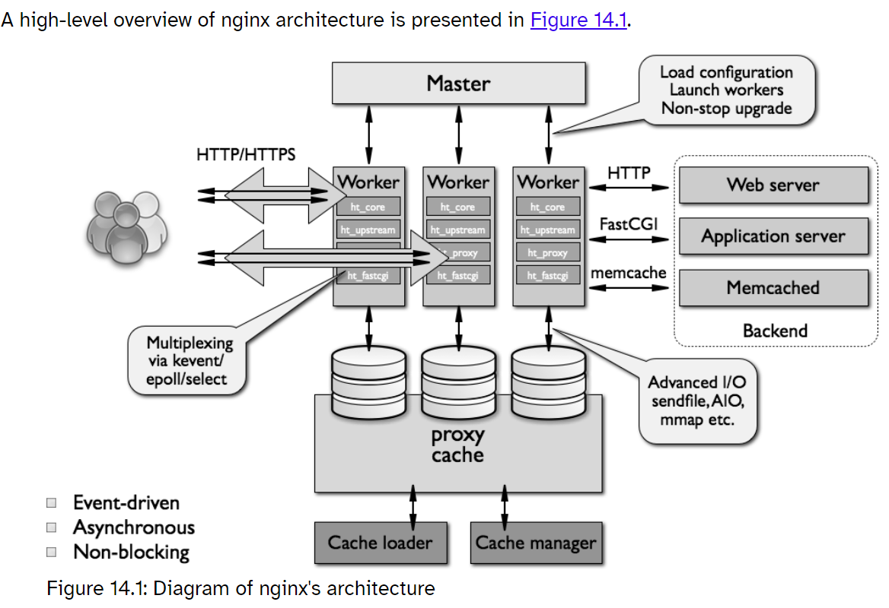

Nginx 学习  
  
# 学习资源  
> [nginx documentation](https://nginx.org/en/docs/)  
> [文件 I/O](https://xiaolincoding.com/os/6_file_system/file_system.html#文件-i-o)  
> [9.2 I/O 多路复用：select/poll/epoll](https://xiaolincoding.com/os/8_network_system/selete_poll_epoll.html#最基本的-socket-模型)  
> 书籍：[深入理解Nginx](https://book.douban.com/subject/26745255/)  
  
# 经典的 Web 服务端 —— Apache  
> [apache](https://apache.org/)  
  
## MPM 模块  
> [Multi-Processing Modules](https://httpd.apache.org/docs/2.4/en/mpm.html)  
  
Multi-Processing Modules (MPMs) are responsible for binding to network ports on the machine, accepting requests, and dispatching children to handle the requests.  
  
## Apache prefork 模型  
> [Apache MPM prefork](https://docs.oracle.com/cd/B14099_19/web.1012/q20206/mod/prefork.html)  
  
- Implements a non-threaded, pre-forking web server  
  
A single control process is responsible for launching child processes which listen for connections and serve them when they arrive.   
Apache always tries to maintain several spare or idle server processes, which stand ready to serve incoming requests.  
  
## Apache worker 模型  
> [Apache MPM worker](https://httpd.apache.org/docs/2.4/mod/worker.html)  
  
- Multi-Processing Module implementing a hybrid multi-threaded multi-process web server  
- 一个控制进程，启动多个子进程，每个子进程包含固定的线程  
- 线程处理请求，线程不够时在启动一个新的子进程  
  
## Apache event 模型  
> [Apache MPM event](https://httpd.apache.org/docs/2.4/mod/event.html)  
  
- A variant of the worker MPM with the goal of consuming threads only for connections with active processing  
- 最新模式，支持事件驱动模型（epoll）  
- 在 worker 模型的基础上，每个子进程中增加一个监听线程，可以释放空闲的线程  
  
  
# 高性能的 Web 服务端 —— Nginx 介绍  
> [nginx](https://nginx.org/en/)  
  
- nginx [engine x] is an HTTP and reverse proxy server, a mail proxy server, and a generic TCP/UDP proxy server, originally written by Igor Sysoev.   
- Nginx 分为社区版和商业版  
- Nginx 的社区版分为开发版（奇数）、最新稳定版（偶数）和过期版  
- 功能丰富，既可以做 http 服务器，又可以做反向代理和邮件服务器  
- 能快速响应静态网页的请求  
- 内置模块多，且支持很多第三方的扩展模块  
  
  
# Nginx VS apache   
> [The Architecture of Open Source Applications (Volume 2) nginx](https://aosabook.org/en/v2/nginx.html)  
  
Although Apache provided a solid foundation for future development, it was architected to spawn a copy of itself for each new connection, which was not suitable for nonlinear scalability of a website.   
  
  
# Nginx 其他二次发行版  
  
  
## Tengine  
  
## OpenResty  
  
  
# Nginx 功能  
> [nginx](https://nginx.org/en/)  
  
- 静态的 Web 资源服务器，处理 html，js，css，图片等静态资源  
- http/https 反向代理  
- 结合 FastCGI/uWSGI/SCGI 等协议反向代理动态资源请求  
- tcp/udp 协议的请求转发（反向代理）  
- imap4/pop3 邮件协议的反向代理  
  
# Nginx 基础特性  
- 模块化设计，较好的扩展性  
- 高可靠性  
- 支持热部署  
不停机更新配置文件，升级版本，更换日志文件  
- 低内存消耗  
10000 个 keep-alive 连接模式下的非活动连接，仅需 2.5M 内存  
- event-driven  
aio, mmap, sendfile  
  
# Nginx 架构  
> [The Architecture of Open Source Applications (Volume 2) nginx](https://aosabook.org/en/v2/nginx.html)  
  
  
  
It is a modular, event-driven, asynchronous, single-threaded, non-blocking architecture.  
  
nginx uses multiplexing and event notifications heavily, and dedicates specific tasks to separate processes. Connections are processed in a highly efficient run-loop in a limited number of single-threaded processes called workers. Within each worker nginx can handle many thousands of concurrent connections and requests per second.  
  
nginx doesn't spawn a process or thread for every connection. Instead, worker processes accept new requests from a shared "listen" socket and execute a highly efficient run-loop inside each worker to process thousands of connections per worker.   
  
The master process is run as the root user. The cache loader, cache manager and workers run as an unprivileged user.  
  
- 多进程模型  
- 一个 Master 主进程和多个 Worker 进程组成  
  
## Master 进程  
- reading and validating configuration  
- creating, binding and closing sockets  
- starting, terminating and maintaining the configured number of worker processes  
- reconfiguring without service interruption  
- controlling non-stop binary upgrades (starting new binary and rolling back if necessary)  
- re-opening log files  
- compiling embedded Perl scripts  
  
## Worker 进程  
The worker processes accept, handle and process connections from clients, provide reverse proxying and filtering functionality and do almost everything else that nginx is capable of.  
  
worker 进程的数量建议设置为核心数以充分利用多核架构  
  
## Cache loader 进程  
The cache loader process is responsible for checking the on-disk cache items and populating nginx's in-memory database with cache metadata.  
  
## Cache manager 进程  
The cache manager is mostly responsible for cache expiration and invalidation. It stays in memory during normal nginx operation and it is restarted by the master process in the case of failure.  
  
## Nginx 对 http 处理过程  
1. Client sends HTTP request.  
2. nginx core chooses the appropriate phase handler based on the configured location matching the request.  
3. If configured to do so, a load balancer picks an upstream server for proxying.  
4. Phase handler does its job and passes each output buffer to the first filter.  
5. First filter passes the output to the second filter.  
6. Second filter passes the output to third (and so on).  
7. Final response is sent to the client.  
  
# Nginx 模块  
- 核心模块  
- 标准模块  
  - HTTP 模块  
  - Mail 模块  
  邮件服务  
  - Stream 模块  
  反向代理功能  
- 第三方模块  
  
# 安装 nginx  
  
## 编译安装  
> [Building nginx from Sources](http://nginx.org/en/docs/configure.html)  
> [Installation and Compile-Time Options](https://www.nginx.com/resources/wiki/start/topics/tutorials/installoptions/)  
  
  
不指定路径时默认编译完后路径如下：  
```bash  
Configuration summary  
  + using system PCRE library  
  + using system OpenSSL library  
  + using system zlib library  
  
  nginx path prefix: "/usr/local/nginx"  
  nginx binary file: "/usr/local/nginx/sbin/nginx"  
  nginx modules path: "/usr/local/nginx/modules"  
  nginx configuration prefix: "/usr/local/nginx/conf"  
  nginx configuration file: "/usr/local/nginx/conf/nginx.conf"  
  nginx pid file: "/usr/local/nginx/logs/nginx.pid"  
  nginx error log file: "/usr/local/nginx/logs/error.log"  
  nginx http access log file: "/usr/local/nginx/logs/access.log"  
  nginx http client request body temporary files: "client_body_temp"  
  nginx http proxy temporary files: "proxy_temp"  
  nginx http fastcgi temporary files: "fastcgi_temp"  
  nginx http uwsgi temporary files: "uwsgi_temp"  
  nginx http scgi temporary files: "scgi_temp"  
```  
  
  
编译完成后用软连接形式将 `nginx` 链接至 PATH 环境变量中，如 `/usr/sbin`  
  
```bash  
[root@VM-ubuntu22 nginx]$ ln -sv /usr/local/nginx/sbin/nginx /usr/sbin/  
```  
  
写 service 文件  
```bash  
[root@VM-ubuntu22 nginx]$ vim /lib/systemd/system/nginx.service  
  
[Unit]  
Description=A high performance web server and a reverse proxy server  
Documentation=https://nginx.org/en/docs/  
After=network.target remote-fs.target nss-lookup.target  
Wants=network-online.target  
  
[Service]  
Type=forking  
PIDFile=/usr/local/nginx/run/nginx.pid  
ExecStartPre=/bin/rm -f /usr/local/nginx/run/nginx.pid  
ExecStartPre=/usr/local/nginx/sbin/nginx -t  
ExecStart=/usr/local/nginx/sbin/nginx -c /usr/local/nginx/conf/nginx.conf  
ExecReload=/bin/kill -s HUP $MAINPID  
ExecStop=/bin/kill -s TERM $MAINPID  
KillSignal=SIGQUIT  
TimeoutStopSec=5  
KillMode=process  
PrivateTmp=true  
LimitNOFILE=100000  
  
[Install]  
WantedBy=multi-user.target  
usr/local/nginx/sbin/nginx'  
```  
  
让 service 文件生效  
```bash  
[root@VM-ubuntu22 nginx]$ systemctl daemon-reload  
```  
查看 nginx.service 状态  
```bash  
[root@VM-ubuntu22 nginx]$ systemctl status nginx.service  
○ nginx.service - A high performance web server and a reverse proxy server  
     Loaded: loaded (/lib/systemd/system/nginx.service; disabled; vendor preset: enabled)  
     Active: inactive (dead)  
       Docs: https://nginx.org/en/docs/  
```  
开启服务并设置为开机自启  
```bash  
[root@VM-ubuntu22 nginx]$ systemctl enable --now nginx.service  
```  
  
ubuntu22.04 编译安装完成后查看编译时选项：  
```bash  
[root@ubuntu22 ~]$ nginx -V  
nginx version: nginx/1.22.1  
built by gcc 11.3.0 (Ubuntu 11.3.0-1ubuntu1~22.04.1)  
built with OpenSSL 3.0.2 15 Mar 2022  
TLS SNI support enabled  
configure arguments: --prefix=/apps/nginx --user=nginx --group=nginx --with-http_ssl_module --with-http_v2_module --with-http_realip_module --with-http_stub_status_module --with-http_gzip_static_module --with-pcre --with-stream --with-stream_ssl_module --with-stream_realip_module  
```  
  
### 添加额外模块编译安装  
> [What does the *-dev *-dbg and *-utils mean?](https://stackoverflow.com/questions/19032398/what-does-the-dev-dbg-and-utils-mean)  
  
  
编译时指定 `--with-pcre`，如果未安装相关库，则会提示：  
```bash  
./configure: error: the HTTP rewrite module requires the PCRE library.  
You can either disable the module by using --without-http_rewrite_module  
option, or install the PCRE library into the system, or build the PCRE library  
statically from the source with nginx by using --with-pcre=<path> option.  
```  
搜索相关库：  
```bash  
[root@VM-ubuntu22 nginx-1.24.0]$ apt list *pcre3*  
Listing... Done  
libpcre3-dbg/jammy-updates,jammy-security 2:8.39-13ubuntu0.22.04.1 amd64  
libpcre3-dev/jammy-updates,jammy-security 2:8.39-13ubuntu0.22.04.1 amd64  
libpcre32-3/jammy-updates,jammy-security 2:8.39-13ubuntu0.22.04.1 amd64  
libpcre3/jammy-updates,jammy-security,now 2:8.39-13ubuntu0.22.04.1 amd64 [installed]  
```  
安装 `libpcre3-dev`  
  
# Nginx 性能优化   
1. sendfile on 使用零拷贝  
2. 高并发配置  
先通过 systemctl status nginx 查看其 PID（需要通过用 systemctl 开启 nginx）  
```bash  
[root@ubuntu22 conf]$ systemctl status nginx.service  
● nginx.service - A high performance web server and a reverse proxy server  
     Loaded: loaded (/lib/systemd/system/nginx.service; enabled; vendor preset: enabled)  
     Active: active (running) since Sun 2023-05-21 10:43:43 CST; 4h 15min ago  
       Docs: https://nginx.org/en/docs/  
    Process: 878 ExecStartPre=/bin/rm -f /apps/nginx/run/nginx.pid (code=exited, status=0/SUCCESS)  
    Process: 901 ExecStartPre=/apps/nginx/sbin/nginx -t (code=exited, status=0/SUCCESS)  
    Process: 928 ExecStart=/apps/nginx/sbin/nginx -c /apps/nginx/conf/nginx.conf (code=exited, status=0/SUCCESS)  
   Main PID: 936 (nginx)  
      Tasks: 3 (limit: 2193)  
     Memory: 3.8M  
        CPU: 65ms  
     CGroup: /system.slice/nginx.service  
             ├─936 "nginx: master process /apps/nginx/sbin/nginx -c /apps/nginx/conf/nginx.conf"  
             ├─939 "nginx: worker process" "" "" "" "" "" "" "" "" "" "" "" "" "" "" "" "" "" "" "" "" "" "" "" >  
             └─940 "nginx: worker process" "" "" "" "" "" "" "" "" "" "" "" "" "" "" "" "" "" "" "" "" "" "" "" >  
  
May 21 10:43:43 ubuntu22 systemd[1]: Starting A high performance web server and a reverse proxy server...  
May 21 10:43:43 ubuntu22 nginx[901]: nginx: the configuration file /apps/nginx/conf/nginx.conf syntax is ok  
May 21 10:43:43 ubuntu22 nginx[901]: nginx: configuration file /apps/nginx/conf/nginx.conf test is successful  
May 21 10:43:43 ubuntu22 systemd[1]: Started A high performance web server and a reverse proxy server.  
```  
  
查看 nginx 并发数限制  
```bash  
[root@ubuntu22 conf]$ cat /proc/936/limits  
Limit                     Soft Limit           Hard Limit           Units  
Max cpu time              unlimited            unlimited            seconds  
Max file size             unlimited            unlimited            bytes  
Max data size             unlimited            unlimited            bytes  
Max stack size            8388608              unlimited            bytes  
Max core file size        0                    unlimited            bytes  
Max resident set          unlimited            unlimited            bytes  
Max processes             7311                 7311                 processes  
Max open files            100000               100000               files  
Max locked memory         65536                65536                bytes  
Max address space         unlimited            unlimited            bytes  
Max file locks            unlimited            unlimited            locks  
Max pending signals       7311                 7311                 signals  
Max msgqueue size         819200               819200               bytes  
Max nice priority         0                    0  
Max realtime priority     0                    0  
Max realtime timeout      unlimited            unlimited            us  
```  
修改 service 文件中 `LimitNOFILE`  
```bash  
 18 [Unit]  
 17 Description=A high performance web server and a reverse proxy server  
 16 Documentation=https://nginx.org/en/docs/  
 15 After=network.target remote-fs.target nss-lookup.target  
 14 Wants=network-online.target  
 13  
 12 [Service]  
 11 Type=forking  
 10 PIDFile=/apps/nginx/run/nginx.pid  
  9 ExecStartPre=/bin/rm -f /apps/nginx/run/nginx.pid  
  8 ExecStartPre=/apps/nginx/sbin/nginx -t  
  7 ExecStart=/apps/nginx/sbin/nginx -c /apps/nginx/conf/nginx.conf  
  6 ExecReload=/bin/kill -s HUP $MAINPID  
  5 ExecStop=/bin/kill -s TERM $MAINPID  
  4 KillSignal=SIGQUIT  
  3 TimeoutStopSec=5  
  2 KillMode=process  
  1 PrivateTmp=true  
19  LimitNOFILE=100000  
  1  
  2 [Install]  
  3 WantedBy=multi-user.target  
```  
  
或者配置文件中修改指令 `worker_rlimit_nofile`  
  
  
查看系统支持最大文件数 `open files`  
```bash  
[root@ubuntu22 conf]$ ulimit -a  
real-time non-blocking time  (microseconds, -R) unlimited  
core file size              (blocks, -c) 0  
data seg size               (kbytes, -d) unlimited  
scheduling priority                 (-e) 0  
file size                   (blocks, -f) unlimited  
pending signals                     (-i) 7311  
max locked memory           (kbytes, -l) 248528  
max memory size             (kbytes, -m) unlimited  
open files                          (-n) 1024  
pipe size                (512 bytes, -p) 8  
POSIX message queues         (bytes, -q) 819200  
real-time priority                  (-r) 0  
stack size                  (kbytes, -s) 8192  
cpu time                   (seconds, -t) unlimited  
max user processes                  (-u) 7311  
virtual memory              (kbytes, -v) unlimited  
file locks                          (-x) unlimited  
```  
  
或者用 `ulimit -n` 获取数值  
  
如果系统支持的最大打开文件数很小，则通过 `/etc/security/limits.conf` 文件设置，添加下面两行：  
```bash  
*      hard    nofile    10000  
*      soft    nofile    10000  
```  
  
3. 开启文件压缩  
```bash  
gzip on  
```  
该功能属于 http_gzip_module，需要查看该模块是否加载  
  
4. 设置会话保持时间  
> [keepalive_time](https://nginx.org/en/docs/http/ngx_http_core_module.html#keepalive_time)  
  
`keepalive_time`  
  
5. 合并请求后统一发给客户端  
`tcp_nopush` 必须开启 sendfile 使用，开启则合并请求后统一发给客户端  
  
`tcp_nodelay` 开启 keepalived 模式下是否启用 `TCP_NODELAY`，不开启则延迟发送  
  
# 查看某个模块是否加载  
如查看模块 http_gzip_module是否加载  
  
1. 编译安装查看  
```bash  
[root@ubuntu22 nginx-1.24.0]$ pwd  
/usr/local/src/nginx-1.24.0  
[root@ubuntu22 nginx-1.24.0]$ ls  
auto  CHANGES  CHANGES.ru  conf  configure  contrib  html  LICENSE  Makefile  man  objs  README  src  
[root@ubuntu22 nginx-1.24.0]$ ./configure --help | grep -i http_gzip_module  
  --without-http_gzip_module         disable ngx_http_gzip_module  
```  
可看见该模块是默认加载，即不指定 `--without-http_gzip_module` 则默认加载  
  
2. 包安装查看   
可以从[官方文档](https://nginx.org/en/docs/)查看对应模块，如果官方未说明不是默认安装，则为默认加载的模块  
而有没有指定，则通过 `nginx -V` 查看，注意 `nginx -V` 输出不是标准输出，而是标准错误输出  
如果要将输出内容通过管道再筛选，需要将其重定向到标准输出，如：  
```bash  
[root@web1 modules]$ nginx -V 2>&1 | grep -i gzip  
```  
  
# Nginx 命令  
> [Command-line parameters](https://nginx.org/en/docs/switches.html)  
  
```bash  
[root@VM-8-8-ubuntu nginx-1.24.0]$ nginx -h  
nginx version: nginx/1.24.0  
Usage: nginx [-?hvVtTq] [-s signal] [-p prefix]  
             [-e filename] [-c filename] [-g directives]  
  
Options:  
-?,-h         : this help  
-v            : show version and exit  
-V            : show version and configure options then exit  
-t            : test configuration and exit  
-T            : test configuration, dump it and exit  
-q            : suppress non-error messages during configuration testing  
-s signal     : send signal to a master process: stop, quit, reopen, reload  
-p prefix     : set prefix path (default: /usr/local/nginx/)  
-e filename   : set error log file (default: logs/error.log)  
-c filename   : set configuration file (default: conf/nginx.conf)  
-g directives : set global directives out of configuration file  
```  
  
## 发送信号  
> [Starting, Stopping, and Reloading Configuration](https://nginx.org/en/docs/beginners_guide.html#control)  
> [Controlling nginx](https://nginx.org/en/docs/control.html)  
  
```bash  
nginx -s signal: send signal to a master process: stop, quit, reopen, reload  
```  
  
- stop — fast shutdown, TERM signal  
- quit — graceful shutdown, QUIT signal  
- reload — reloading the configuration file, HUP signal  
- reopen — reopening the log files, USR1 signal  
  
- USR2	upgrading an executable file  
- WINCH	graceful shutdown of worker processes  
  
`nginx -s reload` 能不停服务情况下重载配置文件  
  
# Nginx 平滑升级和回滚  
> [Upgrading Executable on the Fly](https://nginx.org/en/docs/control.html#upgrade)  
> [How To Upgrade Nginx In-Place Without Dropping Client Connections](https://www.digitalocean.com/community/tutorials/how-to-upgrade-nginx-in-place-without-dropping-client-connections)  
  
  
不停止服务情况下升级版本  
  
# Nginx 变量  
> [Alphabetical index of variables](http://nginx.org/en/docs/varindex.html)  
  
- 变量分为内置变量和自定义变量  
- 自定义变量通过 `set` 指令设置  
```bash  
Syntax:	set $variable value;  
Default:	—  
Context:	server, location, if  
```  
  
常见自定义变量：  
- $remote_addr  
- $remote_port  
- $remote_user  
- $binary_remote_addr  
- $host  
- $request_body  
- $request_body_file  
- $request  
- $scheme  
- $server_addr  
- $server_port  
- $status  
- $cookie  
- $proxy_add_x_forwarded_for  
- $args  
- $is_args  
- $document_root  
- $document_uri  
- $limit_rate  
  
- $http_name  
> [Embedded Variables](https://nginx.org/en/docs/http/ngx_http_core_module.html#variables)  
Arbitrary request header field; the last part of a variable name is the field name converted to lower case with dashes replaced by underscores  
  
# Nginx 配置文件  
不指定路径时默认编译完后路径如下：  
```bash  
Configuration summary  
  + using system PCRE library  
  + using system OpenSSL library  
  + using system zlib library  
  
  nginx path prefix: "/usr/local/nginx"  
  nginx binary file: "/usr/local/nginx/sbin/nginx"  
  nginx modules path: "/usr/local/nginx/modules"  
  nginx configuration prefix: "/usr/local/nginx/conf"  
  nginx configuration file: "/usr/local/nginx/conf/nginx.conf"  
  nginx pid file: "/usr/local/nginx/logs/nginx.pid"  
  nginx error log file: "/usr/local/nginx/logs/error.log"  
  nginx http access log file: "/usr/local/nginx/logs/access.log"  
  nginx http client request body temporary files: "client_body_temp"  
  nginx http proxy temporary files: "proxy_temp"  
  nginx http fastcgi temporary files: "fastcgi_temp"  
  nginx http uwsgi temporary files: "uwsgi_temp"  
  nginx http scgi temporary files: "scgi_temp"  
```  
  
## 配置文件中文件的路径  
安装软件时 `--prefix=path` 设置了安装目录  
  
> --prefix=path  
> defines a directory that will keep server files. This same directory will also be used for all relative paths set by configure (except for paths to libraries sources) and in the nginx.conf configuration file. It is set to the /usr/local/nginx directory by default.  
  
## 配置文件的结构  
> [Configuration File’s Structure](https://nginx.org/en/docs/beginners_guide.html#conf_structure)  
> [Alphabetical index of directives](http://nginx.org/en/docs/dirindex.html)  
  
- 配置文件由指令和指令块构成  
- If a block directive can have other directives inside braces, it is called a context (examples: events, http, server, and location).  
- Directives placed in the configuration file outside of any contexts are considered to be in the main context.  
- 配置文件中使用一个指令（directive）时，需要从官网查该指令在哪个 `Context` 中  
The `events` and `http` directives reside in the `main` context, `server` in `http`, and `location` in `server`.  
- 多个指令如果放在同一行要用 `;` 隔开  
- 用 `#` 添加注释  
- 用 `include` 来包含多个子配置文件  
  
### 单个指令  
名字和参数组成，多个参数由空格隔开，最好加上 `;` 结束  
```bash  
Syntax:	access_log path [format [buffer=size] [gzip[=level]] [flush=time] [if=condition]];  
access_log off;  
Default:	  
access_log logs/access.log combined;  
Context:	http, server, location, if in location, limit_except  
```  
有的指令在 `main` 中则表示不用包含在某个具体的指令块中  
```bash  
Syntax:	user user [group];  
Default:	  
user nobody nobody;  
Context:	main  
```  
  
### 指令块  
指令中包含其他指令，这些指令在花括号中，即在一个 context 中，如：  
```bash  
Syntax:	http { ... }  
Default:	—  
Context:	main  
```  
  
## 配置文件中使用变量  
- [内置变量](http://nginx.org/en/docs/varindex.html)  
如直接用 `$` 引用，如 `$content_length` 表示 `“Content-Length” request header field`  
- `set` 自定义的变量  
set variable value; 通过 `$variable` 引用该变量  
  
## 配置文件中指令书写的顺序  
注意顺序  
  
## 使用子配置文件  
全局配置和子配置最好分开  
全局配置放在 `nginx.conf`，子配置放在 `conf.d/*.conf` 文件中，通过在全局配置用 `include conf.d/*.conf` 包含  
写相对路径，则相对于当前配置文件的路径，默认 `/usr/local/nginx/conf`，也可使用绝对路径，最好将其写在最后，以免影响前面的配置（有顺序）  
子配置文件根据名字字母顺序被先后加载，要指定先后顺序，可以在前面加上数字，如 `00-` `01-`  
  
# 文件类型映射为 MIME 类型   
> [MIME types (IANA media types)](https://developer.mozilla.org/en-US/docs/Web/HTTP/Basics_of_HTTP/MIME_types)  
  
浏览器使用 MIME 类型，Web 服务器要将不同文件扩展名映射为 MIME 类型才能被浏览器识别  
  
## MIME  
> Warning: Browsers use the MIME type, not the file extension, to determine how to process a URL, so it's important that web servers send the correct MIME type in the response's Content-Type header.   
> If this is not correctly configured, browsers are likely to misinterpret the contents of files, sites will not work correctly, and downloaded files may be mishandled.  
  
  
如安装目录在 `/usr/local/nginx` 中，则在 `conf` 子文件夹中有个 `mime.types` 文件  
该文件中的 `type {}` 指令块将文件名扩展映射为 MIME 类型扩展，扩展不区分大小写，后面为文件格式  
```bash  
  1 types {  
  2     text/html                                        html htm shtml;  
  3     text/css                                         css;  
  4     text/xml                                         xml;  
  5     image/gif                                        gif;  
        ...  
    }  
```  
  
# 全局配置  
> [Core functionality](https://nginx.org/en/docs/ngx_core_module.html)  
  
配置的 Contex 为 `main`  
  
## user   
`user` 设置 worker 进程的 user 和 group  
master 进程的 user 和 group 为 root 和 root   
  
```bash  
Syntax:	user user [group];  
Default:	  
user nobody nobody;  
Context:	main  
```  
  
```bash  
user  www-data www-data;  
```  
  
## worker_process  
```bash  
Syntax:	worker_processes number | auto;  
Default:	  
worker_processes 1;  
Context:	main  
```  
- Defines the number of worker processes.  
- The optimal value depends on many factors including (but not limited to) the number of CPU cores, the number of hard disk drives that store data, and load pattern.   
  
## worker_cpu_affinity  
```bash  
Syntax:	worker_cpu_affinity cpumask ...;  
worker_cpu_affinity auto [cpumask];  
Default:	—  
Context:	main  
```  
  
- Binds worker processes to the sets of CPUs.   
- Each CPU set is represented by a bitmask of allowed CPUs.   
- There should be a separate set defined for each of the worker processes.   
- By default, worker processes are not bound to any specific CPUs.  
  
```bash  
worker_processes    4;  
worker_cpu_affinity 0001 0010 0100 1000; # 从左到右依次为 0 号到 3 号CPU  
```  
  
将 worker 进程和 CPU 核心绑定，可以减少 worker 进程再不同的 CPU 核心上来回跳转，从而减少 CPU 对进程的资源分配，回收及内存管理等，因此提升 nginx 的性能  
  
## worker_priority  
```bash  
Syntax:	worker_priority number;  
Default:	  
worker_priority 0;  
Context:	main  
```  
  
Defines the scheduling priority for worker processes like it is done by the nice command: a negative number means higher priority. Allowed range normally varies from -20 to 20.  
  
## worker_rlimit_nofile  
```bash  
Syntax:	worker_rlimit_nofile number;  
Default:	—  
Context:	main  
```  
  
Changes the limit on the maximum number of open files (RLIMIT_NOFILE) for worker processes. Used to increase the limit without restarting the main process.  
  
实际最大打开的文件数不能超过系统设置的值，即 `ulimit -n` 显示的值，修改系统的设置可以通过 `/etc/security/limits.conf` 文件设置，添加下面两行：  
```bash  
*      hard    nofile    10000  
*      soft    nofile    10000  
```  
  
## deamon  
```bash  
Syntax:	daemon on | off;  
Default:	  
daemon on;  
Context:	main  
```  
  
Determines whether nginx should become a daemon. Mainly used during development.  
  
在容器中运行时需要设置为 off，即前台运行 nginx  
  
## pid   
设置 pid 文件的存放路径  
  
```cpp  
Syntax:	pid file;  
Default:	  
pid logs/nginx.pid;  
Context:	main  
```  
  
如果写的是相对路径，则相对于 `--prefix=path` 指定的路径，默认为`/usr/local/nginx`  
```bash  
pid        run/nginx.pid;  
```  
  
## error_log  
全局指定错误日志的路径和等级  
  
```bash  
Syntax:	error_log file [level];  
Default:	  
error_log logs/error.log error;  
Context:	main, http, mail, stream, server, location  
```  
  
```bash  
#error_log  logs/error.log  notice;  
```  
  
## events 指令块  
指令块，事件驱动相关的配置  
  
```bash  
Syntax:	events { ... }  
Default:	—  
Context:	main  
```  
  
### worker_connections  
```bash  
Syntax:	worker_connections number;  
Default:	  
worker_connections 512;  
Context:	events  
```  
  
Sets the maximum number of simultaneous connections that can be opened by a worker process.  
  
生产中可以设置更大一些  
  
### use   
```bash  
Syntax:	use method;  
Default:	—  
Context:	events  
```  
  
设置 connect processing method，如 `use epoll`，支持的其他方法有 select，poll 等，默认会自动选择最有效的方法  
  
### accept_mutex  
```bash  
Syntax:	accept_mutex on | off;  
Default:	  
accept_mutex off;  
Context:	events  
```  
  
If accept_mutex is enabled, worker processes will accept new connections by turn.   
Otherwise, all worker processes will be notified about new connections, and if volume of new connections is low, some of the worker processes may just waste system resources.  
  
如果开启，则请求轮流由 worker 进程处理，这样可以防止将所有的 worker 进程唤醒，即 “惊群”，这样会导致多个 worker 进程竞争一个资源而影响性能和稳定性  
  
### multi_accpet  
```bash  
Syntax:	multi_accept on | off;  
Default:	  
multi_accept off;  
Context:	events  
```  
  
If multi_accept is disabled, a worker process will accept one new connection at a time. Otherwise, a worker process will accept all new connections at a time.  
  
默认关闭，则一个 worker 进程一次只能接受一个新的连接，建议设置为 `on`  
  
# http 指令块  
> [ngx_http_core_module](https://nginx.org/en/docs/http/ngx_http_core_module.html)  
  
  
# server 指令块设置虚拟主机  
> [How nginx processes a request](https://nginx.org/en/docs/http/request_processing.html)  
  
```bash  
server {  
    listen       80;  
    server_name  www.example.com;  
    server_tokens off;  
  
    charset utf-8;  
  
    root   html/wordpress;  
  
    access_log  logs/host.access.log  main;  
  
    client_max_body_size 100M;  
    client_body_buffer_size 1024K;  
    client_body_temp_path /usr/local/nginx/client_body_temp 1 2 2;  
  
    location / {  
        root   html/wordpress;  
        index  index.php index.html index.htm;  
    }  
  
    #error_page  404              /404.html;  
  
    # redirect server error pages to the static page /50x.html  
    #  
    error_page   500 502 503 504  /50x.html;  
    location = /50x.html {  
        root   html;  
    }  
  
    #pass the PHP scripts to FastCGI server listening on 127.0.0.1:9000  
      
    location ~ \.php$ {  
        root           html/wordpress;  
        fastcgi_pass   127.0.0.1:9000;  
        fastcgi_index  index.php;  
        fastcgi_param  SCRIPT_FILENAME  $document_root$fastcgi_script_name;  
        include        fastcgi_params;  
    }  
  
    location /favicon.ico {  
        root html/wordpress/wp-images;  
        access_log off;  
    }  
  
    location ~ ^/(ping|pm_status)$ {  
        fastcgi_pass   127.0.0.1:9000;  
        fastcgi_param  SCRIPT_FILENAME  $document_root$fastcgi_script_name;  
        include        fastcgi_params;  
        auth_basic "Restricted Access";  
        auth_basic_user_file /usr/local/nginx/conf/.pswd/.htpasswd;  
    }  
  
    location = /status.php {  
        root html;  
        fastcgi_pass   127.0.0.1:9000;  
        fastcgi_param  SCRIPT_FILENAME  $document_root$fastcgi_script_name;  
        include        fastcgi_params;  
        auth_basic "Restricted Access";  
        auth_basic_user_file /usr/local/nginx/conf/.pswd/.htpasswd;  
        keepalive_timeout 0;  
    }  
          
    # deny access to .htaccess files, if Apache's document root  
    # concurs with nginx's one  
    #  
    #location ~ /\.ht {  
    #    deny  all;  
    #}  
}  
```  
  
## server_name 虚拟主机名  
> [Server names](https://nginx.org/en/docs/http/server_names.html)  
  
## listen  
> [listen](https://nginx.org/en/docs/http/ngx_http_core_module.html#listen)  
  
  
## 设置默认服务器  
如果有多个服务器提供服务，可以在一个 server {} 块中指定默认服务器，这样，不管该服务器配置文件的顺序在哪都会是默认服务器  
  
```bash  
server {  
    listen 80 default server;   
}  
```  
  
# 设置编码格式  
默认编码为俄罗斯编码，改为 `utf-8`  
该指令可以在 http context 中设置，这样对全部的 server 都生效，或者在某个特定的 server 中设置  
```bash  
charset utf-8;  
```  
  
# 指定默认 MIME 类型  
```bash  
Syntax:	default_type mime-type;  
Default:	  
default_type text/plain;  
Context:	http, server, location  
```  
  
```bash  
include       mime.types;  
default_type  application/octet-stream;  
```  
  
`include` 包含文件，使用的是相对路径，相对于 `--prefix=path` 指定的路径中 `conf` 子文件的路径， 默认 `/usr/local/nginx/conf`，也可以写绝对路径  
  
如果设置的类型不对，当没有指定的 mime.types 文件中没有指定类型时，可能不能正常显示页面，如访问文件变成下载文件  
  
# 不同服务器日志文件分开存放  
默认有访问日志 `access_log` 和错误日志 `error_log` 两个日志文件，所有 server 的日志均在两个文件中  
如果有多个 server，可以在每个 server 指令块中分别存放日志文件，日志文件名可以加上 server 的名字  
  
# 指定响应报文 server 首部  
```bash  
Syntax:	server_tokens on | off | build | string;  
Default:	  
server_tokens on;  
Context:	http, server, location  
```  
  
Enables or disables emitting nginx version on error pages and in the “Server” response header field.  
  
```bash  
[ubuntu@VM-8-8-ubuntu ~]$ curl -I www.nginx.org  
HTTP/1.1 301 Moved Permanently  
Server: nginx/1.23.4  
Date: Mon, 27 Nov 2023 10:25:02 GMT  
Content-Type: text/html  
Content-Length: 169  
Connection: keep-alive  
Keep-Alive: timeout=15  
Location: http://nginx.org/  
```  
  
# 指定日志文件的格式  
> [Module ngx_http_log_module](https://nginx.org/en/docs/http/ngx_http_log_module.html)  
> [Configuring Logging](https://docs.nginx.com/nginx/admin-guide/monitoring/logging/)  
  
`log_format` 可以指定日志格式，如默认配置中  
```bash  
#log_format  main  '$remote_addr - $remote_user [$time_local] "$request" '  
#                  '$status $body_bytes_sent "$http_referer" '  
#                  '"$http_user_agent" "$http_x_forwarded_for"';  
#access_log  logs/access.log  main;  
```  
  
通过 `log_format` 指定一个格式，该配置的名字为 `main`，然后指定访问日志 `access_log` 使用格式为 `main` 的日志格式  
  
# access_log 访问日志设置  
> [access_log](https://nginx.org/en/docs/http/ngx_http_log_module.html#access_log)  
  
- 当访问某些资源时，可以不记录访问日志  
  
```bash  
location ~* .*\.(gif|jpg|png|ico|css|jpg|jpeg)$ {  
  access_log off;  
  #access_log /dev/null;  
}  
```  
  
# 自定义错误页面  
> [error_page](https://nginx.org/en/docs/http/ngx_http_core_module.html#error_page)  
  
- 看官网例子，很详细  
- 可以修改错误响应码，如发生 404 错误时，将响应码改为 200 并跳转到首页，如：  
```bash  
error_page   500 502 503 504  /50x.html;  
location = /50x.html {  
    root   html;  
}  
```  
此时如果浏览器中输入错误页面，跳转到了 index.html，但其 url 中显示的仍为错误的路径  
用 curl 命令查看响应码变为 200  
```bash  
[root@ubuntu22 html]$ curl 127.0.0.1/xxx  
index.html 10.0.0.202  
```  
```bash  
[root@ubuntu22 html]$ curl 127.0.0.1/xxx -i  
HTTP/1.1 200 OK  
Server: nginx/1.22.1  
Date: Sun, 21 May 2023 09:48:46 GMT  
Content-Type: text/html; charset=utf-8  
Content-Length: 22  
Last-Modified: Sun, 21 May 2023 09:27:37 GMT  
Connection: keep-alive  
ETag: "6469e409-16"  
Accept-Ranges: bytes  
  
index.html 10.0.0.202  
```  
  
# 设置 root 路径  
```bash  
Syntax:	root path;  
Default:	  
root html;  
Context:	http, server, location, if in location  
```  
  
```bash  
 1         location / {  
 2             root   html;  
 3             index  index.html index.htm;  
 4         }  
 5  
 6         #error_page  404              /404.html;  
 7  
 8         # redirect server error pages to the static page /50x.html  
 9         #  
10  
11         error_page   404  =200 /index.html;  
12         error_page   500 502 503 504  /50x.html;  
13         location = /50x.html {  
14             root   html;  
15         }  
```  
  
上面指定根（/）为 html 文件夹  
当出现 404 错误时，将错误码改为 200，并显示 `/index.html`，即根 `html` 文件夹下的 `index.html` 文件  
  
# 设置路径别名 alias  
```bash  
Syntax:	alias path;  
Default:	—  
Context:	location  
```  
  
Defines a replacement for the specified location.  
  
```bash  
location /i/ {  
    alias /data/w3/images/;  
}  
```  
  
on request of “/i/top.gif”, the file /data/w3/images/top.gif will be sent.  
  
区别于 `/root`，别名直接用指定的路径替换匹配的路径  
如果匹配的是目录，即最后有 `/`，则别名指定的也必须是目录，最后带 `/`  
  
# location   
> [location](https://nginx.org/en/docs/http/ngx_http_core_module.html#location)  
  
```bash  
Syntax:	location [ = | ~ | ~* | ^~ ] uri { ... }  
location @name { ... }  
Default:	—  
Context:	server, location  
```  
根据 URI 匹配不同的配置，看官网例子与讲解  
  
# 重定向请求 localtion @name  
The “@” prefix defines a named location. Such a location is not used for a regular request processing, but instead used for request redirection. They cannot be nested, and cannot contain nested locations.  
  
```bash  
server {  
    listen 80;  
    server_name www.example.com;  
    root /data/www;  
    location / {  
        index index.html;  
    }  
  
    #将 404 错误页面重定向到 @error_404这个location上  
    error_page 404 @error_404;  
    location @error_404 {  
        return 200;  
    }  
}  
```  
  
# 四层访问控制  
> [Module ngx_http_access_module](https://nginx.org/en/docs/http/ngx_http_access_module.html)  
  
- 可以用来限制某个 IP 或某个网段地址的访问  
- 相当于白名单和黑名单  
- 也可以用防火墙规则来实现  
- 有 `allow` 和 `deny` 两个指令  
- 小范围在前，大范围在后，如果只允许少量地址访问，其他拒绝，则 `allow` 几个地址后用 `deny all;`  
  
- 匹配到第一个满足的条件后，不会再往下找其他规则，直接生效，和防火墙规则设置类似，因此，如果第一个条件 `deny` 某个地址，第二个条件 `allow` 某个地址，则会 `deny` 不会 `allow`  
  
```bash  
location / {  
    deny  192.168.1.1;  
    allow 192.168.1.0/24;  
    allow 10.1.1.0/16;  
    allow 2001:0db8::/32;  
    deny  all;  
}  
```  
  
# 网页认证访问  
> [Module ngx_http_auth_basic_module](http://nginx.org/en/docs/http/ngx_http_auth_basic_module.html)  
  
如为状态页等特殊页面设置访问密码  
  
```bash  
location ~ ^/(ping|pm_status)$ {  
    fastcgi_pass   127.0.0.1:9000;  
    fastcgi_param  SCRIPT_FILENAME  $document_root$fastcgi_script_name;  
    include        fastcgi_params;  
    auth_basic "Restricted Access";  
    auth_basic_user_file /usr/local/nginx/conf/.pswd/.htpasswd;  
}  
  
location = /status.php {  
    root html;  
    fastcgi_pass   127.0.0.1:9000;  
    fastcgi_param  SCRIPT_FILENAME  $document_root$fastcgi_script_name;  
    include        fastcgi_params;  
    auth_basic "Restricted Access";  
    auth_basic_user_file /usr/local/nginx/conf/.pswd/.htpasswd;  
    keepalive_timeout 0;  
}  
```  
`auth_basic_user_file` 用于指定存放账号密码的文件  
  
生成用户密码文件可以用 `htpasswd` 命令  
```bash  
[root@VM-8-8-ubuntu .pswd]$ htpasswd -c file username  
New password:  
Re-type new password:  
Adding password for user username  
```  
密码文件：  
```bash  
username:$apr1$bLy4TkWu$ooKRgilAsK/1RSP8mXMOK1  
```  
其中 `apr1` 为加密算法类型，`bLy4TkWu` 为盐值，最后一部分为密码  
  
可以用 openssl passwd 加密得到和上诉相同的密码以验证密码  
```bash  
[root@VM-8-8-ubuntu .pswd]$ openssl passwd -apr1 -salt bLy4TkWu  
Password:  
$apr1$bLy4TkWu$ooKRgilAsK/1RSP8mXMOK1  
```  
  
# try_files 文件不存在时查找其他文件  
> [try_files](https://nginx.org/en/docs/http/ngx_http_core_module.html#try_files)  
  
```bash  
Syntax:	try_files file ... uri;  
try_files file ... =code;  
Default:	—  
Context:	server, location  
```  
  
```bash  
location /images/ {  
    try_files $uri /images/default.gif;  
}  
  
location = /images/default.gif {  
    expires 30s;  
}  
  
location / {  
    try_files $uri $uri/index.html $uri.html =404;  
}  
```  
  
当用户访问根下 `images/` 目录时，首先查找该目录 `$uri`，  
如果找不到，则使用 `/images/default.gif`  
  
按照顺序一个一个往后找，如果最后一个也找不到，则报错  
  
# 持续连接（persistent connection）  
> [keepalive_timeout](https://nginx.org/en/docs/http/ngx_http_core_module.html#keepalive_timeout)  
  
HTTP/1.1 协议支持持续连接，即万维网服务器在发送响应给客户端（浏览器）后仍在一段时间内保持这条连接，使同一客户端和该服务器可以继续在这条连接上传输后续的 HTTP 请求报文和响应报文  
  
这种持续连接只要传送的文档都在一个服务器上就行，不局限于一个页面的文档  
  
```bash  
Syntax:	keepalive_timeout timeout [header_timeout];  
Default:	  
keepalive_timeout 75s;  
Context:	http, server, location  
```  
The first parameter sets a timeout during which a keep-alive client connection will stay open on the server side.  
  
  
```bash  
Syntax:	keepalive_time time;  
Default:	  
keepalive_time 1h;  
Context:	http, server, location  
This directive appeared in version 1.19.10.  
```  
Limits the maximum time during which requests can be processed through one keep-alive connection.  
  
  
```bash  
Syntax:	keepalive_requests number;  
Default:	  
keepalive_requests 1000;  
Context:	http, server, location  
This directive appeared in version 0.8.0.  
```  
Sets the maximum number of requests that can be served through one keep-alive connection.   
  
  
# index 指定索引文件  
> [Module ngx_http_index_module](https://nginx.org/en/docs/http/ngx_http_index_module.html#index) `index` 这个指令用于指定某个目录的索引文件，当访问的路径以 `/` 结尾时，表示目录  
如果未指定目录，则默认为根目录 `/`，可以为目录指定索引文件  
  
索引文件可以写多个，和 `try_files` 规则相同，按照顺序依次查找，用找到的第一个文件  
  
```bash  
location / {  
    index index.$geo.html index.html;  
}  
```  
  
# 利用自动索引生成目录  
> [Module ngx_http_autoindex_module](http://nginx.org/en/docs/http/ngx_http_autoindex_module.html)  
  
The ngx_http_autoindex_module module processes requests ending with the slash character (‘/’) and produces a directory listing.   
  
```bash  
location /download {  
    root html/download;  
    autoindex on; # 开启自动索引功能  
    autoindex_exact_size on; # 计算文件的大小，单位为 byte  
    autoindex_localtime on; # 显示本机时间  
    charset utf8;  
    limit_rate 1024k; # 限速  
}  
```  
  
html 文件夹内新建 download 子文件夹，从清华大学镜像源下载仓库测试  
```bash  
rsync -avz rsync://mirrors.tuna.tsinghua.edu.cn/ubuntu download/ubuntu  
```  
  
# 文件上传的参数设置  
```bash  
Syntax:	client_max_body_size size;  
Default:	  
client_max_body_size 1m;  
Context:	http, server, location  
```  
Sets the maximum allowed size of the client request body.   
  
  
```bash  
Syntax:	client_body_buffer_size size;  
Default:	  
client_body_buffer_size 8k|16k;  
Context:	http, server, location  
```  
Sets buffer size for reading client request body.  
  
  
```bash  
Syntax:	client_body_temp_path path [level1 [level2 [level3]]];  
Default:	  
client_body_temp_path client_body_temp;  
Context:	http, server, location  
```  
Defines a directory for storing temporary files holding client request bodies.  
```bash  
client_body_temp_path /spool/nginx/client_temp 1 2;  
```  
  
# 设置网站图标 favicon  
```bash  
location /favicon.ico {  
    root html/wordpress/wp-images;  
    access_log off;  
}  
```  
  
`favicon` 为浏览器中显示的网址图标，当浏览器中浏览其他网页时，该网页位置显示网页图标，如果浏览器找不到该图标，则会报错  
  
# 限流限速  
  
## 限制下载速度  
```bash  
Syntax:	limit_rate rate;  
Default:	  
limit_rate 0;  
Context:	http, server, location, if in location  
```  
Limits the rate of response transmission to a client. The rate is specified in bytes per second.   
  
默认 0 表示不限速  
  
```bash  
server {  
  
    if ($slow) {  
        set $limit_rate 4k;  
    }  
  
    ...  
}  
```  
  
  
```bash  
Syntax:	limit_rate_after size;  
Default:	  
limit_rate_after 0;  
Context:	http, server, location, if in location  
This directive appeared in version 0.8.0.  
```  
Sets the initial amount after which the further transmission of a response to a client will be rate limited.  
  
```bash  
location /flv/ {  
    flv;  
    limit_rate_after 500m;  
    limit_rate       500k;  
}  
```  
在下载 500M 的数据后开始限速，限速为每秒 500k bytes  
  
## 限制请求数  
```bash  
Syntax:	limit_req zone=name [burst=number] [nodelay | delay=number];  
Default:	—  
Context:	http, server, location  
```  
```bash  
Syntax:	limit_req_zone key zone=name:size rate=rate [sync];  
Default:	—  
Context:	http  
```  
  
  
```bash  
limit_req_zone $binary_remote_addr zone=perip:10m rate=1r/s;  
limit_req_zone $server_name zone=perserver:10m rate=10r/s;  
  
server {  
    ...  
    limit_req zone=perip burst=5 nodelay;  
    limit_req zone=perserver burst=10;  
}  
```  
`$binary_remote_addr` 表示以客户端IP地址作为限流依据的 key  
`zone` 为存放 IP以及URL访问频率的共享内存区域  
`rate` 为请求速率，1r/s 表示平均每秒处理不超过1个请求  
`burst`表示在超过限制速率之前，允许在一定时间窗口内处理的最大请求数  
The `delay` parameter specifies a limit at which excessive requests become delayed. `nodey` 表示超出限制则返回错误而不是延迟处理  
  
## 限制并非连接数  
```bash  
Syntax:	limit_conn zone number;  
Default:	—  
Context:	http, server, location  
```  
```bash  
Syntax:	limit_conn_zone key zone=name:size;  
Default:	—  
Context:	http  
```  
  
```bash  
limit_conn_zone $binary_remote_addr zone=addr:10m;  
  
server {  
    location /download/ {  
    limit_conn addr 1;  
}  
```  
限制某个 ip 地址的某个时间的并发连接数为 1  
  
# 状态页设置  
> [Module ngx_http_stub_status_module](https://nginx.org/en/docs/http/ngx_http_stub_status_module.html#stub_status)  
  
该模块不是默认配置的，需要编译安装时添加 `--with-http_stub_status_module` 选项  
  
```bash  
location = /basic_status {  
    stub_status;  
}  
```  
  
# 压缩  
> [NGINX GZIP_STATIC: WHAT IT DOES AND HOW TO USE IT?](https://www.carnaghan.com/nginx-gzip_static/)  
> [Module ngx_http_gzip_module](https://nginx.org/en/docs/http/ngx_http_gzip_module.html)  
  
- 默认加载该模块  
- 通过 gzip 压缩传输文件  
  
```bash  
gzip            on; # 默认 off  
gzip_min_length 1k; # gzip 压缩的最小文件大小  
gzip_proxied    expired no-cache no-store private auth;  
gzip_types      text/plain application/xml;  
gzip_comp_level 5; # 压缩比  
```  
  
```bash  
Syntax:	gzip_min_length length;  
Default:	  
gzip_min_length 20;  
Context:	http, server, location  
```  
Sets the minimum length of a response that will be gzipped. The length is determined only from the “Content-Length” response header field.  
  
# rewrite 模块  
> [Module ngx_http_rewrite_module](https://nginx.org/en/docs/http/ngx_http_rewrite_module.html)  
  
  
The ngx_http_rewrite_module module is used to change request URI using PCRE regular expressions, return redirects, and conditionally select configurations.  
  
## break  
```bash  
Syntax:	break;  
Default:	—  
Context:	server, location, if  
```  
Stops processing the current set of ngx_http_rewrite_module directives.  
  
If a directive is specified inside the location, further processing of the request continues in this location.  
  
如果在 location 中使用 break，location 中后面的 ngx_http_rewrite_module 模块中的指令不再执行，如 `set` 指令，但其他指令仍会执行，如 `echo`   
  
  
## if  
```bash  
if ($http_user_agent ~ MSIE) {  
    rewrite ^(.*)$ /msie/$1 break;  
}  
  
if ($http_cookie ~* "id=([^;]+)(?:;|$)") {  
    set $id $1;  
}  
  
if ($request_method = POST) {  
    return 405;  
}  
  
if ($slow) {  
    limit_rate 10k;  
}  
  
if ($invalid_referer) {  
    return 403;  
}  
```  
  
## return  
```bash  
Syntax:	return code [text];  
return code URL;  
return URL;  
Default:	—  
Context:	server, location, if  
```  
  
Stops processing and returns the specified code to a client. The non-standard code 444 closes a connection without sending a response header.  
  
注意返回的状态码有要求，不能随便写，具体见官方文档  
  
## set  
设置变量  
  
## rewrite  
```bash  
Syntax:	rewrite regex replacement [flag];  
Default:	—  
Context:	server, location, if  
```  
  
If the specified regular expression matches a request URI, URI is changed as specified in the replacement string.   
The rewrite directives are executed sequentially in order of their appearance in the configuration file.  
  
  
flag:  
- last  
stops processing the current set of ngx_http_rewrite_module directives and starts a search for a new location matching the changed URI;  
找到匹配的 URL 后会开始对匹配的 RUL 进行新的重写匹配，可能多次匹配，新的匹配会重头开始匹配，最好不要放在 location 中使用，注意避免形成死循环  
- break  
stops processing the current set of ngx_http_rewrite_module directives as with the break directive;  
只进行一次重写匹配，匹配完成则不再继续匹配  
- redirect  
returns a temporary redirect with the 302 code; used if a replacement string does not start with “http://”, “https://”, or “$scheme”;  
临时重定向，客户端根据重定向的 RUL 重新发起请求  
- permanent  
returns a permanent redirect with the 301 code.  
永久重定向，客户端根据重定向的 RUL 重新发起请求  
  
## rewrite_log  
```bash  
Syntax:	rewrite_log on | off;  
Default:	  
rewrite_log off;  
Context:	http, server, location, if  
```  
  
Enables or disables logging of ngx_http_rewrite_module module directives processing results into the error_log at the notice level.  
  
## uninitialized_variable_warn  
```bash  
Syntax:	uninitialized_variable_warn on | off;  
Default:	  
uninitialized_variable_warn on;  
Context:	http, server, location, if  
```  
  
## 使用场景  
### 重定向错误的 RUL  
当访问的 RUL 不存在时，重定向到其他地址  
  
```bash  
server {  
    listen 80;  
    server_name www.example.com;  
  
    location / {  
      if (!-e $request_filename) {  
        rewrite .* index.html; # 302 跳转  
      }  
    }  
}  
```  
  
### 根据客户端类型跳转  
根据客户端使用的手机或电脑设备跳转到不同的网页  
  
```bash  
server {  
    listen 80;  
    server_name www.example.com;  
    root /html/wordpress;  
    if ($http_user_agent ~* "android|iphone|ipad") {  
      rewrite ^/(.*)$ http://www.new.com/$1 redirect;  
    }  
}  
```  
  
### 网址维护跳转  
网站维护时，只特定的 IP 访问，其他访问均跳转到维护页面  
  
```bash  
server {  
    listen 80;  
    server_name www.example.com;  
    root html/wordpress;  
  
    set $ip 0;  
  
    if ($remote_addr = 10.0.0.101) {  
    set $ip 1;  
    }  
    if ($remote_addr = 10.0.0.102) {  
    set $ip 1;  
    }  
    if ($ip = 0) {  
      rewrite ^/(.*)$ /maintain.html break; # html/wordpress/maintain.html  
    }  
}  
```  
  
# Https 配置  
> [Module ngx_http_ssl_module](https://nginx.org/en/docs/http/ngx_http_ssl_module.html)  
> [Configuring HTTPS servers](https://nginx.org/en/docs/http/configuring_https_servers.html)  
  
  
`ngx_http_ssl_module` 模块不是默认加载，编译时需要指定 `--with-http_ssl_module` 选项且安装额外的库  
  
```bash  
worker_processes auto;  
  
http {  
  
...  
  
server {  
    listen              443 ssl;  
    keepalive_timeout   70;  
  
    ssl_protocols       TLSv1 TLSv1.1 TLSv1.2 TLSv1.3;  
    ssl_ciphers         AES128-SHA:AES256-SHA:RC4-SHA:DES-CBC3-SHA:RC4-MD5;  
    ssl_certificate     /usr/local/nginx/conf/cert.pem;  
    ssl_certificate_key /usr/local/nginx/conf/cert.key;  
    ssl_session_cache   shared:SSL:10m;  
    ssl_session_timeout 10m;  
  
    ...  
}  
```   
  
# 多域 Https  
> [Server Name Indication](https://nginx.org/en/docs/http/configuring_https_servers.html#sni)  
  
  
单个 IP 地址配置多个域名  
  
  
```bash  
ssl_certificate     common.crt;  
ssl_certificate_key common.key;  
  
server {  
    listen          443 ssl;  
    server_name     www.example.com;  
    ...  
}  
  
server {  
    listen          443 ssl;  
    server_name     www.example.org;  
    ...  
}  
```  
  
# HSTS 强制使用 https  
> [HTTP Strict Transport Security (HSTS) and NGINX](https://www.nginx.com/blog/http-strict-transport-security-hsts-and-nginx/)  
  
HSTS seeks to deal with the potential vulnerability by instructing the browser that a domain can only be accessed using HTTPS. Even if the user enters or follows a plain HTTP link, the browser strictly upgrades the connection to HTTPS.  
  
强制使用 https 协议，如果用户使用 http 链接，将其自动转到 https  
  
方法一：  
```bash  
server {  
    listen 443 ssl;  
    server_name www.wang.org;  
    add_header Strict-Transport-Security "max-age=31536000; includeSubDomains" always;  
  
    location / {  
      root html/wordpress;  
      if ( $scheme = http ) {  
          rewrite ^(.*)$ https://$server_name$1 permanent;  
      }  
      或者用 return   
      if ( $scheme = http ) {  
          return $ https://$server_name$request_rui; # 默认302  
      }  
    }  
}  
```  
上面方法中匹配 http 方法，重写为 https，用 return 简单，rewrite 则则更灵活，设置项更多  
  
方法二：  
```bash  
server {  
  listen 80;  
  server_name www.example.com;  
  return 302 https://$server_name$request_uri;  
}  
  
server {  
    listen 443 ssl;  
    server_name www.wang.org;  
    add_header Strict-Transport-Security "max-age=31536000; includeSubDomains" always;  
  
    location / {  
       root html/wordpress;  
    }  
}  
```  
  
# 防盗链  
> [Module ngx_http_referer_module](https://nginx.org/en/docs/http/ngx_http_referer_module.html)  
  
防盗链（Hotlinking）是一种措施，用于阻止其他网站在未经许可的情况下直接链接到你网站上的资源（如图片、视频、音频等）。这意味着其他网站无法通过直接引用你的资源 URL 来显示或嵌入它们在自己的页面上。  
  
防盗链的目的是保护你网站的带宽和资源，并确保只有你的网站或特定授权的网站能够访问和使用你的资源。当其他网站尝试在未经许可的情况下链接到你的资源时，你可以采取一些措施来阻止或限制它们的访问。  
  
`Referer`（引用页）是一个 HTTP 头部字段，用于指示当前请求的来源页面的 URL。当浏览器向服务器发送请求时，会在请求头中包含 `Referer` 字段，告诉服务器当前请求是从哪个页面跳转过来的。  
  
防盗链通常会使用 `Referer` 字段来进行判断。服务器可以检查 `Referer` 字段，如果发现请求的来源不是自己的网站，就拒绝提供资源或返回替代内容。  
  
例如，假设你的网站上有一张图片 `example.com/image.jpg`，你可以在服务器配置中添加防盗链规则，检查请求的 `Referer` 字段。如果 `Referer` 字段不是你的网站 `example.com`，服务器可以返回一个替代的图片或拒绝提供图片资源。  
  
需要注意的是，`Referer` 字段是由客户端浏览器提供的，并且可以被修改或伪造。因此，防盗链措施仅仅是一种基本的安全机制，可以阻止大多数非授权的直接链接，但并不能完全防止盗链行为。  
  
```bash  
valid_referers none blocked server_names  
    *.example.com example.* www.example.org/galleries/  ~\.google\.;  
  
if ($invalid_referer) {  
    return 403;  
}  
```  
  
# 升级 OpenSSL   
OpenSSL 是一个功能强大的开源密码库，提供了一系列密码学功能和工具，包括加密、解密、哈希、数字签名、证书管理等。它是一个广泛使用的库，用于网络通信、安全协议实现、证书管理和加密应用等领域。  
  
要及时关注版本是否有漏洞，需要升级等，以避免漏洞带来的安全问题  
  
从官网下载最新的 openssl，然后编译 nginx 时指定 openssl 的路径  
```bash  
wget https://www.openssl.org/source/openssl-3.2.0.tar.gz  
tar xfv openssl-3.2.0.tar.gz -C /usr/local/src/  
```  
  
```bash  
[root@VM-8-8-ubuntu nginx-1.24.0]$ ./configure --help | grep -i openssl  
--with-openssl=DIR                 set path to OpenSSL library sources  
--with-openssl-opt=OPTIONS         set additional build options for OpenSSL  
```  
  
```bash  
./config ... --with-openssl=/usr/local/src/openssl-3.2.0 ...  
```  
  
# 第三方模块  
添加第三方模块，在编译时 `./config --add-module=path` 指定第三方模块的路径  
  
## 流量监控模块  
> [nginx-module-vts](https://github.com/vozlt/nginx-module-vts)  
  
```bash  
http {  
    vhost_traffic_status_zone;  
  
    ...  
  
    server {  
  
        ...  
  
        location /status {  
            vhost_traffic_status_display;  
            vhost_traffic_status_display_format html;  
        }  
    }  
}  
```  
  
## echo 模块显示信息  
> [openresty/echo-nginx-module](https://github.com/openresty/echo-nginx-module)  
  
- 放在 `location` context 中  
- 需要指定其 MIME 类型，否则浏览器中不会识别为文本而将其下载成一个文件  
```bash  
 location /echo {  
  default_type text/html;  
  echo "The current uri is $request_uri";  
  echo "The current ip is $remote_addr";  
}  
```  
  
- curl 查看换行，浏览器中未换行  
  
```bash  
[root@mysql ~]$ curl 10.0.0.202/echo  
The current uri is /echo  
The current ip is 10.0.0.82  
The current ip is  
The current ip is /apps/nginx/html  
[root@mysql ~]$  
[root@mysql ~]$ curl 10.0.0.202/echo | cat -A  
  % Total    % Received % Xferd  Average Speed   Time    Time     Time  Current  
                                 Dload  Upload   Total   Spent    Left  Speed  
100   107    0   107    0     0   104k      0 --:--:-- --:--:-- --:--:--  104k  
The current uri is /echo$  
The current ip is 10.0.0.82$  
The current ip is $  
The current ip is /apps/nginx/html$  
[root@mysql ~]$  
[root@mysql ~]$ curl 10.0.0.202/echo | cat  
  % Total    % Received % Xferd  Average Speed   Time    Time     Time  Current  
                                 Dload  Upload   Total   Spent    Left  Speed  
100   107    0   107    0     0  53500      0 --:--:-- --:--:-- --:--:-- 53500  
The current uri is /echo  
The current ip is 10.0.0.82  
The current ip is  
The current ip is /apps/nginx/html  
```  
  
#  Nginx 做反向代理  
  
## 正向代理和反向代理  
- 正向代理  
为客户端代理，可用于保护客户端隐私，访问控制，缓存等  
- 反向代理  
为服务器做代理，如负载均衡器，客户端不知道后端实际处理请求的服务器，只知道反向代理服务器  
  
## 四层代理和七层代理的区别  
四层代理服务器，如 lvs，仅转发请求给后端服务器，不和客户端进行 TCP 连接，不监听端口 (如 80 端口)，仅根据传入的 IP 和端口进行转发，后端服务器可以直接看到客户端的 IP 地址  
  
七层代理服务器，如 nginx，监听端口，如 80，和客户端进行 TCP 连接，后端服务器要进行设置才能看到客户端的地址（x-forwarded-for）   
  
## Nginx reverse proxy 模块  
> [NGINX Reverse Proxy](https://docs.nginx.com/nginx/admin-guide/web-server/reverse-proxy/)  
  
nginx 可以用不同的协议将请求转发给其他服务器，分别由不同模块处理  
  
- [ngx_http_proxy_module](https://nginx.org/en/docs/http/ngx_http_proxy_module.html)  
将客户端请求以 http 协议转发至指定服务器处理  
- [ngx_http_upstream_module](https://nginx.org/en/docs/http/ngx_http_upstream_module.html)  
The ngx_http_upstream_module module is used to define groups of servers that can be referenced by the proxy_pass, fastcgi_pass, uwsgi_pass, scgi_pass, memcached_pass, and grpc_pass directives.  
- [ngx_stream_proxy_module](https://nginx.org/en/docs/stream/ngx_stream_proxy_module.html)  
The ngx_stream_proxy_module module (1.9.0) allows proxying data streams over TCP, UDP (1.9.13), and UNIX-domain sockets.  
- [ngx_http_fastcgi_module](https://nginx.org/en/docs/http/ngx_http_fastcgi_module.html)  
The ngx_http_fastcgi_module module allows passing requests to a FastCGI server.  
  
处理 php 请求  
- [ngx_http_uwsgi_module](https://nginx.org/en/docs/http/ngx_http_uwsgi_module.html)  
The ngx_http_uwsgi_module module allows passing requests to a uwsgi server.  
  
处理 python 请求  
  
## Http 反向代理  
> [ngx_http_proxy_module](https://nginx.org/en/docs/http/ngx_http_proxy_module.html)  
  
将客户端请求以 http 协议转发至指定服务器处理  
  
如将不同资源代理给不同的服务器处理  
```bash  
server {  
    location ~ \.(jpe?g|png|bmp|gif)$ {  
        proxy_pass http://10.0.0.18;   
    }  
}  
```  
### proxy_pass 指定后端服务器地址  
> [proxy_pass](https://nginx.org/en/docs/http/ngx_http_proxy_module.html#proxy_pass)  
  
  
- 查看官网例子，注意 URL 后是否有斜线 `/` 的区别~  
```bash  
location /some/path/ {  
    index index.html;  
    proxy_pass http://127.0.0.1;  
}  
```  
proxy_pass 指定的 URL 最后无 `/`，则将匹配的 location 的路径加到 URL 最后，即 http://127.0.0.1/some/path/index.html  
  
```bash  
location /some/path/ {  
    index index.html;  
    proxy_pass http://127.0.0.1/;  
}  
```  
proxy_pass 指定的 URL 最后有 `/`，则访问后端服务器的资源的路径为proxy_pass 中指定的地址，即 http://127.0.0.1/index.html  
  
  
- 端口号  
不指明则默认 80，后端服务器可以用其他端口，如 8080，此时需要指明端口  
```bash  
location /some/path/ {  
    index index.html;  
    proxy_pass http://127.0.0.1:8080;  
}  
```  
  
### proxy_pass_header 向客户端传递一些首部字段  
Permits passing otherwise disabled header fields from a proxied server to a client.  
  
By default, nginx does not pass the header fields “Date”, “Server”, “X-Pad”, and “X-Accel-...” from the response of a proxied server to a client.  
  
```bash  
location /some/path/ {  
    index index.html;  
    proxy_pass http://127.0.0.1:8080;  
    proxy_pass_header Server;  
}  
```  
  
### proxy_hide_header 不向客户端传递一些首部字段  
The proxy_hide_header directive sets additional fields that will not be passed.  
  
### proxy_set_header 更改客户端请求头部信息  
```bash  
Syntax:	proxy_set_header field value;  
Default:	  
proxy_set_header Host $proxy_host;  
proxy_set_header Connection close;  
Context:	http, server, location  
```  
  
`proxy_set_header CIP $remote_addr;` 在请求头部添加参数记录客户端 IP  
  
```bash  
proxy_set_header X-Forwarded-For $proxy_add_x_forwarded_for; #在请求头部添加参数记录客户端 IP  
proxy_set_header Host       $host:$proxy_port;  
```  
  
### proxy_connect_timeout 代理与后端服务器连接超时时间  
```bash  
Syntax:	proxy_connect_timeout time;  
Default:	  
proxy_connect_timeout 60s;  
Context:	http, server, location  
```  
  
### proxy_cache 使用缓存功能  
可以针对特定目录或服务器等设置缓存  
  
默认关闭  
```bash  
Syntax:	proxy_cache zone | off;  
Default:	  
proxy_cache off;  
Context:	http, server, location  
```  
  
Defines a shared memory zone used for caching.   
  
  
定义缓存路径  
```bash  
proxy_cache_path /data/nginx/cache levels=1:2 keys_zone=one:10m;  
```  
  
针对不同的响应码设置缓存时长  
```bash  
proxy_cache_valid 200 302 10m;  
proxy_cache_valid 404      1m;  
```  
  
针对客户端的请求方法缓存  
```bash  
Syntax:	proxy_cache_methods GET | HEAD | POST ...;  
Default:	  
proxy_cache_methods GET HEAD;  
Context:	http, server, location  
This directive appeared in version 0.7.59.  
```  
  
### 向后端服务器透传客户端 IP  
> [$proxy_add_x_forwarded_for](https://nginx.org/en/docs/http/ngx_http_proxy_module.html#var_proxy_add_x_forwarded_for)  
  
```bash  
proxy_set_header X-Forwarded-For $proxy_add_x_forwarded_for; #在请求头部添加参数记录客户端 IP  
```  
  
the “X-Forwarded-For” client request header field with the $remote_addr variable appended to it, separated by a comma. If the “X-Forwarded-For” field is not present in the client request header, the $proxy_add_x_forwarded_for variable is equal to the $remote_addr variable.  
  
```bash  
log_format  main  '$remote_addr - $remote_user [$time_local] "$request" '  
                      '$status $body_bytes_sent "$http_referer" '  
                      '"$http_user_agent" "$http_x_forwarded_for"';  
```  
默认日志格式中有变量 `$http_x_forwarded_for`  
  
## Nginx 做七层负载均衡器  
> [Using nginx as HTTP load balancer](https://nginx.org/en/docs/http/load_balancing.html)  
> [Module ngx_http_upstream_module](https://nginx.org/en/docs/http/ngx_http_upstream_module.html)  
  
```bash  
upstream dynamic {  
    zone upstream_dynamic 64k;  
  
    server backend1.example.com      weight=5;  
    server backend2.example.com:8080 fail_timeout=5s slow_start=30s;  
    server 192.0.2.1                 max_fails=3;  
    server backend3.example.com      resolve;  
    server backend4.example.com      service=http resolve;  
  
    server backup1.example.com:8080  backup;  
    server backup2.example.com:8080  backup;  
}  
  
server {  
    location / {  
        proxy_pass http://dynamic;  
        health_check;  
    }  
}  
```  
  
nginx 反向代理服务器作为负载均衡器，将请求代理到后端多台服务器，且为不同服务器设置权重调度等  
  
### 会话绑定  
#### 基于 IP 地址实现会话绑定  
> [Session persistence](https://nginx.org/en/docs/http/load_balancing.html#nginx_load_balancing_with_ip_hash)  
  
```bash  
upstream myapp1 {  
    ip_hash;  
    server srv1.example.com;  
    server srv2.example.com;  
    server srv3.example.com;  
}  
```  
  
#### 基于 cookie 实现会话绑定  
> [$cookie_name](https://nginx.org/en/docs/http/ngx_http_core_module.html#variables)  
  
变量 `$cookie_name` 表示 key 为 `name` 的 cookie  
  
curl -b 设置 cookie  
```bash  
curl -b, --cookie <data|filename>  
  (HTTP) Pass the data to the HTTP server in the Cookie header.   
  It is supposedly the data previously received from the server in a "Set-Cookie:" line.   
  The data should be in the format "NAME1=VALUE1; NAME2=VALUE2".  
```  
  
```bash  
[root@VM-8-8-ubuntu html]$ curl -b test=c1 -vI www.nginx.org  
*   Trying 3.125.197.172:80...  
*   Trying 2a05:d014:edb:5702::6:80...  
* Immediate connect fail for 2a05:d014:edb:5702::6: Network is unreachable  
*   Trying 2a05:d014:edb:5704::6:80...  
* Immediate connect fail for 2a05:d014:edb:5704::6: Network is unreachable  
* Connected to www.nginx.org (3.125.197.172) port 80 (#0)  
> HEAD / HTTP/1.1  
> Host: www.nginx.org  
> User-Agent: curl/7.81.0  
> Accept: */*  
> Cookie: test=c1  
```  
  
```bash  
http {  
    upstream myapp1 {  
    hash $cookie_test; #绑定 key 为 test 的 cookie   
    server srv1.example.com;  
    server srv2.example.com;  
  
    server {  
        server_name www.example.com;  
        location / {  
        proxy_pass myapp1;  
        proxy_set_header Host $http_host; #转发主机头至后端服务器  
        }  
    }  
}  
```  
  
请求时可用用 `curl -b test=c1 www.example.com` 携带 cookie 测试  
  
## Nginx 做四层负载均衡  
> [Module ngx_stream_proxy_module](https://nginx.org/en/docs/stream/ngx_stream_proxy_module.html)  
> [Module ngx_stream_core_module](https://nginx.org/en/docs/stream/ngx_stream_core_module.html)  
> [TCP and UDP Load Balancing](https://docs.nginx.com/nginx/admin-guide/load-balancer/tcp-udp-load-balancer/)  
  
The ngx_stream_proxy_module module (1.9.0) allows proxying data streams over TCP, UDP (1.9.13), and UNIX-domain sockets.  
  
`stream` 指令块用于配置基于流（TCP/UDP）的代理和负载均衡，编译安装需要指定 `--with-stream` 选项  
  
官网例子：  
```bash  
stream {  
    upstream stream_backend {  
        least_conn;  
        server backend1.example.com:12345 weight=5;  
        server backend2.example.com:12345 max_fails=2 fail_timeout=30s;  
        server backend3.example.com:12345 max_conns=3;  
    }  
      
    upstream dns_servers {  
        least_conn;  
        server 192.168.136.130:53;  
        server 192.168.136.131:53;  
        server 192.168.136.132:53;  
    }  
      
    server {  
        listen        12345;  
        proxy_pass    stream_backend;  
        proxy_timeout 3s;  
        proxy_connect_timeout 1s;  
    }  
      
    server {  
        listen     53 udp;  
        proxy_pass dns_servers;  
    }  
      
    server {  
        listen     12346;  
        proxy_pass backend4.example.com:12346;  
    }  
}  
```  
  
## 代理请求到 FastCGI 服务器  
> [Module ngx_http_fastcgi_module](http://nginx.org/en/docs/http/ngx_http_fastcgi_module.html)  
  
The ngx_http_fastcgi_module module allows passing requests to a FastCGI server.  
  
### CGI  
> [Common Gateway Interface](https://en.wikipedia.org/wiki/Common_Gateway_Interface)  
> [CGI vs FastCGI vs PHP-FPM](https://medium.com/@miladev95/cgi-vs-fastcgi-vs-php-fpm-afbc5a886d6d)  
  
In computing, Common Gateway Interface (CGI) is an interface specification that enables web servers to execute an external program to process HTTP/S user requests.  
  
早期的 web 服务器处理静态文件，后期出现动态文件，如 php, java 等开发的网站，但 nginx 不能处理 php 这种文件，因此通过 CGI 将客户端的 php 请求转发给第三方服务器处理，第三方服务器处理完后将数据返回给 nginx  
  
### FastCGI  
> [FastCGI](https://en.wikipedia.org/wiki/FastCGI)  
> [CGI vs FastCGI vs PHP-FPM](https://medium.com/@miladev95/cgi-vs-fastcgi-vs-php-fpm-afbc5a886d6d)  
  
FastCGI's main aim is to reduce the overhead related to interfacing between web server and CGI programs, allowing a server to handle more web page requests per unit of time.  
  
CGI 效率低，web 服务器每收到一个请求就要创建一个 CGI 进程，处理完再关闭该进程，而 FastCGI 则处理完不会关闭进程，一个进程可以处理多个请求  
  
### php-fpm  
> [FastCGI Process Manager (FPM) ](https://www.php.net/manual/en/install.fpm.php)  
  
FPM (FastCGI Process Manager) is a primary PHP FastCGI implementation containing some features (mostly) useful for heavy-loaded sites.  
  
php-fpm 是实现 php fastcgi 的程序，提供进程管理功能，管理 master 进程和 worker 进程，master 进程监听端口，接收请求，worker 进程一般有多个，每个 worker 进程包含 php 解析器，处理 php 请求  
  
  
### FastCGI 配置  
  
将 php 请求交给 php-fpm 程序，该程序可以和 nginx 在一个机器上，也可以在不同服务器上  
  
```bash  
#pass the PHP scripts to FastCGI server listening on 127.0.0.1:9000  
  
location ~ \.php$ {  
    root           html/wordpress;  
    fastcgi_pass   127.0.0.1:9000;  
    fastcgi_index  index.php;  
    fastcgi_param  SCRIPT_FILENAME  $document_root$fastcgi_script_name;  
    include        fastcgi_params;  
}  
  
location ~ ^/(ping|pm_status)$ {  
    fastcgi_pass   127.0.0.1:9000;  
    fastcgi_param  SCRIPT_FILENAME  $document_root$fastcgi_script_name;  
    include        fastcgi_params;  
    auth_basic "Restricted Access";  
    auth_basic_user_file /usr/local/nginx/conf/.pswd/.htpasswd;  
}  
  
location = /status.php {  
    root html;  
    fastcgi_pass   127.0.0.1:9000;  
    fastcgi_param  SCRIPT_FILENAME  $document_root$fastcgi_script_name;  
    include        fastcgi_params;  
    auth_basic "Restricted Access";  
    auth_basic_user_file /usr/local/nginx/conf/.pswd/.htpasswd;  
    keepalive_timeout 0;  
}  
```  
  
### LNMP wordpress 搭建  
docker 搭建：[docker/lab/LNMP-wordpress-02](https://github.com/lxwcd/docker/tree/main/lab/LNMP-wordpress-02)  
